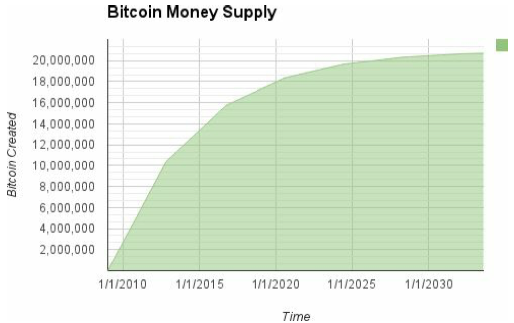
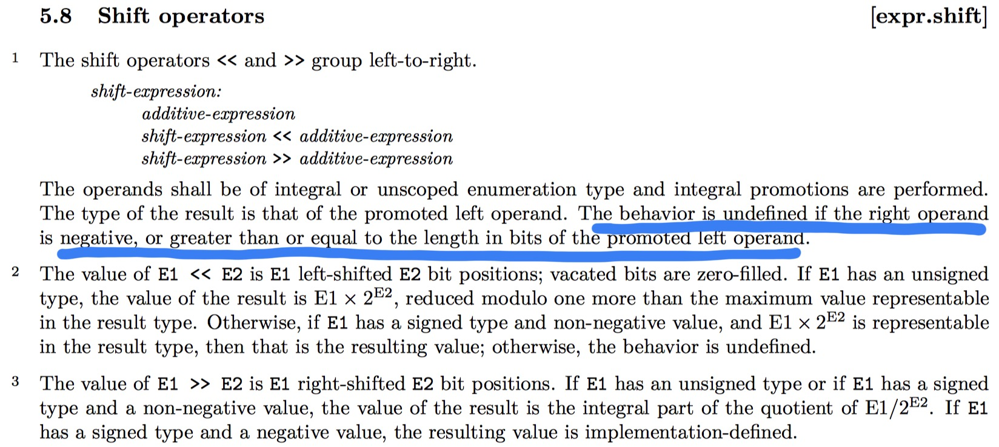

# Bitcoin's Monetary Supply (BIP42)

Long Wen  

20180712


在Bitcoin的白皮书第6小节**Incentive**，Satoshi Nakamoto写到：

> Once a predetermined number of coins have entered circulation, the incentive can transition entirely to transaction fees and be completely inflation free.

结合Bitcoin代码中关于2100万个总量的设定，Bitcoin的2100万个Bitcoin总量的上限已经广为人知，
但是Bitcoin中相关的代码实现，却没有成功执行这一总量上限约束（打脸Code Is Law）。
从Bitcoin最开始的实现直到0.9.2版本的发布修正相应问题[（BIP42）](https://github.com/bitcoin/bips/blob/master/bip-0042.mediawiki)之前，
这一2100万个总量的限制并没有被Bitcoin的代码强制约束。
根据C++语言编译器的行为，在64次挖矿奖励折半之后，挖矿奖励周期有可能重新开始。
这也是BIP42所致力于解决的问题。
需要注意的是，虽然BIP42是在2014年的愚人节（20140401）创建的，并且其中的措辞有搞笑的成分，比如 Abstract 中

> Although it is widely believed that Satoshi was an inflation-hating goldbug he never said this, and in fact programmed Bitcoin's money supply to grow indefinitely, forever.

或者 Proposal 小节中：

> Instead, how about we stop thinking about long term issues when we'll all be dead (barring near lightspeed travel, cryogenic revival, or other technology— like cryptocurrency— which only exists in science fiction).

但是问题是真实存在的，在Bitcoin v0.9.2中合入了[pull#3842](https://github.com/bitcoin/bitcoin/pull/3842)来修正这一问题，参见[Pieter Wuille的Twitter](https://twitter.com/pwuille/status/980598317242552320)以及[bitcoin/doc/bips.md](https://github.com/bitcoin/bitcoin/blob/master/doc/bips.md).

## Monetary Supply in Bitcoin

根据《Mastering Bitcoin - Programming the Open Blockchain》中的描述，Bitcoin中的货币供应（挖矿奖励）曲线如下：



或者可以用代码模拟挖矿奖励演变，根据下面代码的执行结果可以发现比特币的总量为2099999997690000 Satoshis。
也跟根据此，整个Bitcoin社区都在为Code-is-Law的想法与实践而激动。
上面的图示以及下面的代码确实展示了Bitcoin设计的动机，但是在Bitcoin的真正实现中，由于所依赖的C++语言的未定义的行为，2100万上限的设定随着时间（2个世纪之后）的推移，可以被突破。这也是BIP42致力于解决的问题，通过消除这一问题来重新约束Bitcoin的总量供应。

```python
# Original block reward for miners was 50 BTC start_block_reward = 50
# 210000 is around every 4 years with a 10 minute block interval

reward_interval = 210000

def max_money():
	# 50 BTC = 50 0000 0000 Satoshis
	current_reward = 50 * 10**8
	total = 0
	i = 0;
	while current_reward > 0:
		print "loops", i, current_reward
		total += reward_interval * current_reward
		current_reward /= 2
		i = i + 1
	return total


print "Total BTC to ever be created:"
print max_money(), "Satoshis"
```

```bash
[bitmain@LongMac ]money-supply $ python max_money.py
Total BTC to ever be created:
loops 0 5000000000
loops 1 2500000000
loops 2 1250000000
loops 3 625000000
loops 4 312500000
loops 5 156250000
loops 6 78125000
loops 7 39062500
loops 8 19531250
loops 9 9765625
loops 10 4882812
loops 11 2441406
loops 12 1220703
loops 13 610351
loops 14 305175
loops 15 152587
loops 16 76293
loops 17 38146
loops 18 19073
loops 19 9536
loops 20 4768
loops 21 2384
loops 22 1192
loops 23 596
loops 24 298
loops 25 149
loops 26 74
loops 27 37
loops 28 18
loops 29 9
loops 30 4
loops 31 2
loops 32 1
2099999997690000 Satoshis
```


## The Problem - Undefined Behavior in C++ Specification


0.9.2版本之前的Bitcoin实现中，矿工在构造新区块时，利用`GetBlockValue`函数确定自己的挖矿奖励，网络节点验证新区快时，也通过该函数返回值，判定新的区块中的挖矿奖励数额是否符合规则（Code is Law的体现）。
但是0.8.0版本及其之前的Bitcoin实现中，`GetBlockValue`函数却依赖了C++语言规范中未定义的行为（undefined behaviour in the C++ specification），这可能会导致在64次挖矿奖励折半之后，挖矿奖励周期重新开始，也会直接导致Bitcoin的供应总量超过2100万个。
以[0.8.0版本中`main.cpp`中`GetBlockValue`函数的实现](https://github.com/bitcoin/bitcoin/blob/v0.8.0/src/main.cpp#L1053)为例：

```c++
int64 static GetBlockValue(int nHeight, int64 nFees)
{
    int64 nSubsidy = 50 * COIN;

    // Subsidy is cut in half every 210000 blocks, which will occur approximately every 4 years
    nSubsidy >>= (nHeight / 210000);

    return nSubsidy + nFees;
}
```

C++ 2011的标准草案（跟最终标准基本一致）《ISO/IEC 14882 Information technology -- Programming languages -- C++》Third Edition 2011-09-01版本5.17小节 Assignment and compound assignment operators中写到`E1 >>= E2`等价于 `E1 = E1 >> E2`（except that `E1` is evaluated only once）:


而在5.8小节Shift operators中对位移操作`>>`操作的说明如下，也即当`E1 >>= E2`中的`E2`超过`E1`的比特长度时，该运算的结果是未定义的。



考察[0.8.0版本中`main.cpp`中`GetBlockValue`函数的实现](https://github.com/bitcoin/bitcoin/blob/v0.8.0/src/main.cpp#L1053)，当`nSubsidy >>= (nHeight / 210000);`语句中的`nHeight / 210000`大于等于64时，`nSubsidy`的值是未定义的。而现在大多数C++编译器在处理超过64比特的位移时，并没有返回0值作为结果，参考下面的代码以及执行结果。


```c++
static const CAmount COIN = 100000000;
int main() {
    int64 total = 50 * COIN;
    for (int i = 0; i < 30; ++i) {
        int64 r1 = (total >> i);
        int64 r2 = (total >> (i + 30));
        int64 r3 = (total >> (i + 60));
        printf("%2d: %10lld || %2d: %10lld || %2d: %10lld\n", 
        		  i, r1, i + 30, r2, i + 60, r3);
    }
}
```

```bash
[bitmain@LongMac ]bitcoin $ alias
alias clang++='clang++ -std=c++14 -stdlib=libc++'
alias ls='ls -GFh'
[bitmain@LongMac ]bitcoin $ clang++ -v
Apple LLVM version 9.1.0 (clang-902.0.39.2)
Target: x86_64-apple-darwin17.6.0
Thread model: posix
InstalledDir: /Library/Developer/CommandLineTools/usr/bin
[bitmain@LongMac ]bitcoin $
[bitmain@LongMac ]bitcoin $ clang++ test_get_block_subsidy.cpp -o test_get_block_subsidy.exe
[bitmain@LongMac ]bitcoin $ ./test_get_block_subsidy.exe
    0:           5000000000 ||    30:                    4 ||    60:                    0
    1:           2500000000 ||    31:                    2 ||    61:                    0
    2:           1250000000 ||    32:                    1 ||    62:                    0
    3:            625000000 ||    33:                    0 ||    63:                    0
    4:            312500000 ||    34:                    0 ||    64:           5000000000
    5:            156250000 ||    35:                    0 ||    65:           2500000000
    6:             78125000 ||    36:                    0 ||    66:           1250000000
    7:             39062500 ||    37:                    0 ||    67:            625000000
    8:             19531250 ||    38:                    0 ||    68:            312500000
    9:              9765625 ||    39:                    0 ||    69:            156250000
   10:              4882812 ||    40:                    0 ||    70:             78125000
   11:              2441406 ||    41:                    0 ||    71:             39062500
   12:              1220703 ||    42:                    0 ||    72:             19531250
   13:               610351 ||    43:                    0 ||    73:              9765625
   14:               305175 ||    44:                    0 ||    74:              4882812
   15:               152587 ||    45:                    0 ||    75:              2441406
   16:                76293 ||    46:                    0 ||    76:              1220703
   17:                38146 ||    47:                    0 ||    77:               610351
   18:                19073 ||    48:                    0 ||    78:               305175
   19:                 9536 ||    49:                    0 ||    79:               152587
   20:                 4768 ||    50:                    0 ||    80:                76293
   21:                 2384 ||    51:                    0 ||    81:                38146
   22:                 1192 ||    52:                    0 ||    82:                19073
   23:                  596 ||    53:                    0 ||    83:                 9536
   24:                  298 ||    54:                    0 ||    84:                 4768
   25:                  149 ||    55:                    0 ||    85:                 2384
   26:                   74 ||    56:                    0 ||    86:                 1192
   27:                   37 ||    57:                    0 ||    87:                  596
   28:                   18 ||    58:                    0 ||    88:                  298
   29:                    9 ||    59:                    0 ||    89:                  149
```

所以当`nSubsidy >>= (nHeight / 210000)时;`语句中的`nHeight / 210000`大于等于64时，通过调用`GetBlockValue`获得的挖矿奖励会重新回到50个Bitcoin每区块，也即BIP42中的图示：


根据`test_get_block_subsidy.exe`的执行结果，当`nHeight / 210000 == 64`时挖矿奖励会重新变成50个Bitcoin。也即`210000 * 64.0 / (365 * 24 * 6) = 255.7`年之后，都会重新进入一个挖矿奖励周期，从50个Bitcoin开始。

> Thanks to the new-goldmine interval being exactly 64 times the halving interval, and 64 being the size in bits of the currency datatype, the cycle repeats itself every 64 halvings on all currently supported platforms.


## The Fix And Thoughts

BIP42修正了`GetBlockValue`的函数实现，消除对C++的未定义行为的依赖，通过一次Bitcoin的软分叉来解决上述问题。
[修正后的`GetBlockValue`函数的实现](https://github.com/bitcoin/bitcoin/blob/v0.9.2/src/main.cpp)如下，也即在位移之前首先判断折半次数是否大于等于64，如果是，只返回交易手续费作为挖矿奖励。

```C++
int64_t GetBlockValue(int nHeight, int64_t nFees)
{
    int64_t nSubsidy = 50 * COIN;
    int halvings = nHeight / Params().SubsidyHalvingInterval();

    // Force block reward to zero when right shift is undefined.
    if (halvings >= 64)
        return nFees;

    // Subsidy is cut in half every 210,000 blocks which will occur approximately every 4 years.
    nSubsidy >>= halvings;

    return nSubsidy + nFees;
}
```
修正该问题的两次commit为：

[Fix for GetBlockValue() after block 13,440,000 #3842 - Edit subsidy_limit_test to account for BIP42](https://github.com/bitcoin/bitcoin/pull/3842/commits/5cfd3a70a67ba707a8f074a1730724a6e86353b8)

[Fix for GetBlockValue() after block 13,440,000 #3842 - Fix for GetBlockValue() after block 13,440,000](https://github.com/bitcoin/bitcoin/pull/3842/commits/c5a9d2ca9e3234db9687c8cbec4b5b93ec161190)

值得注意的是，除了这个缺陷之外，在Bitcoin的历史上，还有过另外一次因为C++代码的执行问题所引发的漏洞：[CVE-2010-5139](https://en.bitcoin.it/wiki/Common_Vulnerabilities_and_Exposures#CVE-2010-5139)。
**2010年8月15日，高度746389的区块被发现有一笔交易凭空为两个地址创建了184Billion的Bitcoin**。

> This was possible because **the code used for checking transactions before including them in a block didn't account for the case of outputs so large that they overflowed when summed**. A new version was published within a few hours of the discovery. The block chain had to be forked. Although many unpatched nodes continued to build on the "bad" block chain, the "good" block chain overtook it at a block height of 74691. The bad transaction no longer exists for people using the longest chain.

这笔交易的详细信息为：

```bash
CBlock(hash=0000000000790ab3, ver=1, hashPrevBlock=0000000000606865, hashMerkleRoot=618eba,
nTime=1281891957, nBits=1c00800e, nNonce=28192719, vtx=2)
  CTransaction(hash=012cd8, ver=1, vin.size=1, vout.size=1, nLockTime=0)
    CTxIn(COutPoint(000000, -1), coinbase 040e80001c028f00)
    CTxOut(nValue=50.51000000, scriptPubKey=0x4F4BA55D1580F8C3A8A2C7)
  CTransaction(hash=1d5e51, ver=1, vin.size=1, vout.size=2, nLockTime=0)
    CTxIn(COutPoint(237fe8, 0), scriptSig=0xA87C02384E1F184B79C6AC)
    CTxOut(nValue=92233720368.54275808, scriptPubKey=OP_DUP OP_HASH160 0xB7A7)
    CTxOut(nValue=92233720368.54275808, scriptPubKey=OP_DUP OP_HASH160 0x1512)
  vMerkleTree: 012cd8 1d5e51 618eba

Block hash: 0000000000790ab3f22ec756ad43b6ab569abf0bddeb97c67a6f7b1470a7ec1c
Transaction hash: 1d5e512a9723cbef373b970eb52f1e9598ad67e7408077a82fdac194b65333c9
```

正如V神在reddit上[In case you missed it two years ago, BIP 42 is hilarious and addressed a real problem](https://www.reddit.com/r/btc/comments/4r878s/in_case_you_missed_it_two_years_ago_bip_42_is/)主题下的讨论所说：

> There was another unintuitive feature in bitcoin's "specification written in the C++ core code" way back in the day which actually did have more short-term consequences, allowing arbitrary users to generate 186 billion BTC for themselves out of nowhere. This was unfortunately soft-forked away.

V神的第二个评论则直指Bitcoin社区一直信奉的Code-is-law或者Code-is-specification的信条：

> Sure; I agree it was a flaw in the implementation. I was more making a reductio-ad-absurdum against people who literally think that the C++ implementation in bitcoin core is the protocol specification (they do exist).

## 引用

[https://github.com/bitcoin/bips/blob/master/bip-0042.mediawiki](https://github.com/bitcoin/bips/blob/master/bip-0042.mediawiki)

[pull#3842](https://github.com/bitcoin/bitcoin/pull/3842)

[CVE-2010-5139](https://en.bitcoin.it/wiki/Common_Vulnerabilities_and_Exposures#CVE-2010-5139)

[In case you missed it two years ago, BIP 42 is hilarious and addressed a real problem](https://www.reddit.com/r/btc/comments/4r878s/in_case_you_missed_it_two_years_ago_bip_42_is/)

[Pieter Wuille的Twitter](https://twitter.com/pwuille/status/980598317242552320)

## 代码

[max_money.py](https://github.com/cryptostu/blog/blob/master/bips/bip42/max_money.py)

[test_get_block_subsidy.cpp](https://github.com/cryptostu/blog/blob/master/bips/bip42/test_get_block_subsidy.cpp)


本文由 Copernicus团队 `温隆` 写作，转载无需授权。
